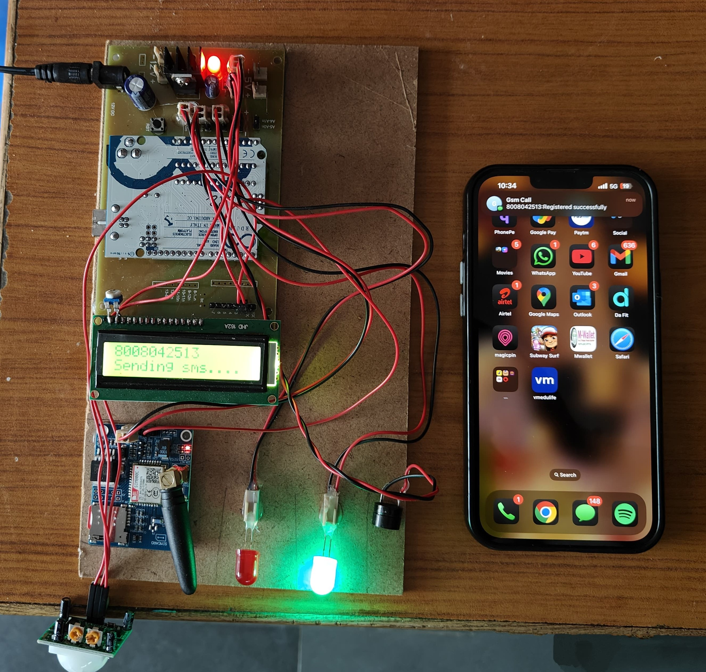
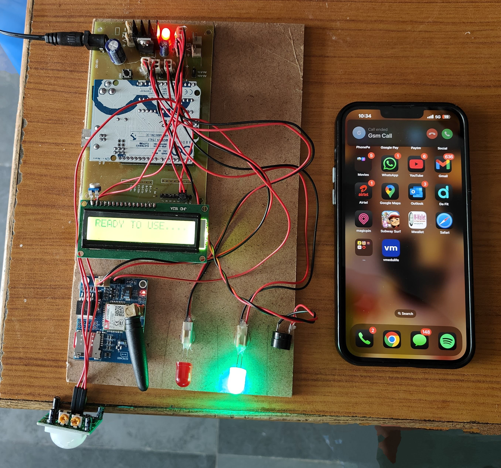
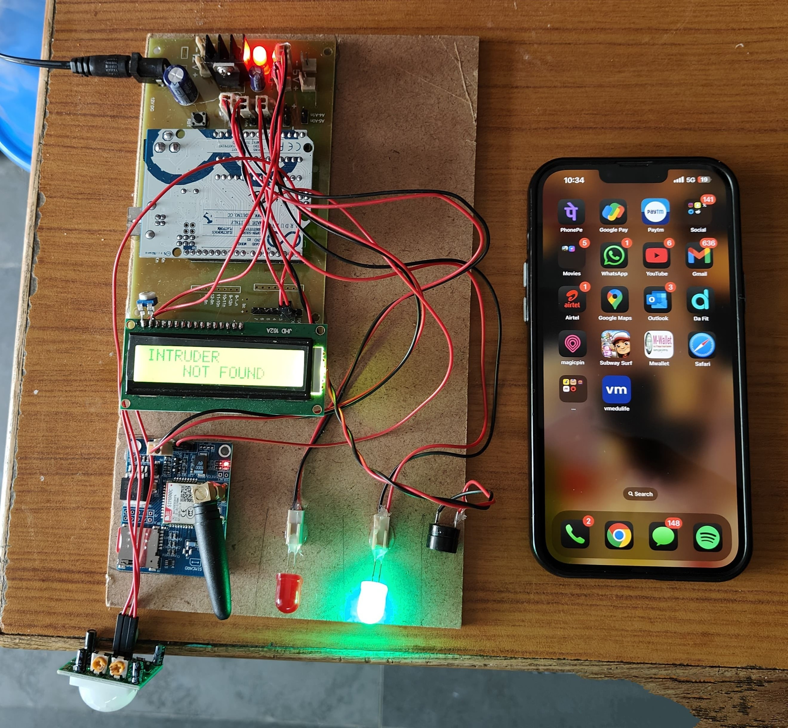
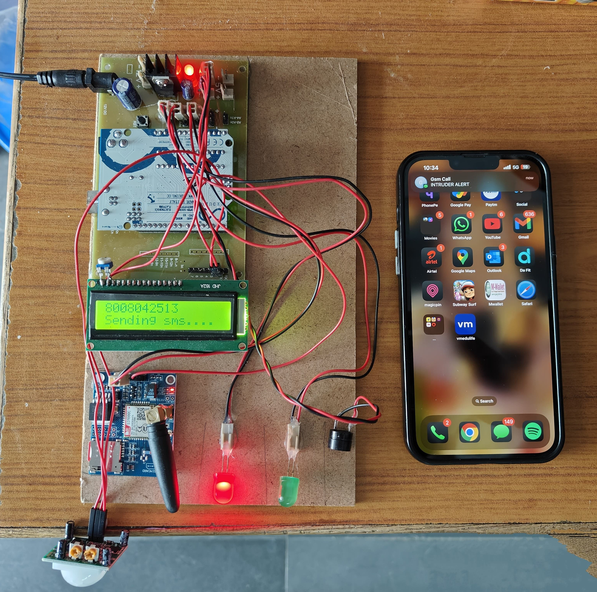
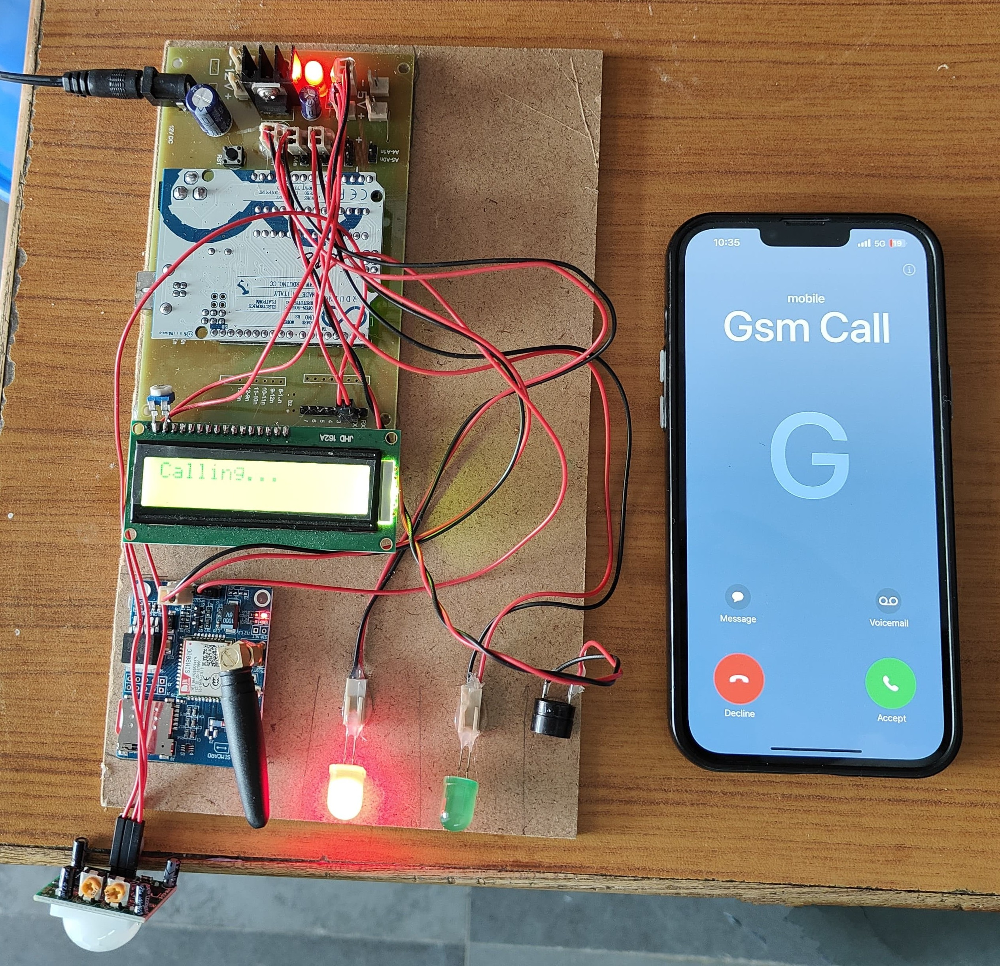

# GSM-Based Home Security System

## 📖 Overview

The **GSM-Based Home Security System** is an embedded security solution designed to detect unauthorized human movement and instantly notify the homeowner through **SMS alerts** and **phone calls** using GSM communication.

The system is built using an **Arduino Uno**, **SIM800C GSM Module**, and **PIR Motion Sensor**. When motion is detected, the Arduino processes the sensor input and triggers the GSM module to send an alert message and initiate a phone call to a predefined mobile number. Local alerts are also provided through a buzzer, LEDs, and an LCD display.

This project provides a **cost-effective**, **reliable**, and **internet-independent** security solution suitable for homes, offices, and small-scale establishments.

---

## ✨ Features

* Real-time motion detection using PIR Sensor
* Instant SMS notification through GSM network
* Automatic phone call alert to the registered mobile number
* LCD display for system status monitoring
* Audio alert using buzzer
* Visual status indication using LEDs
* Standalone operation without internet connectivity
* Low-cost and easy-to-deploy security solution

---

## 🛠 Hardware Components

| Component            | Description                         |
| -------------------- | ----------------------------------- |
| Arduino Uno          | Main microcontroller unit           |
| SIM800C GSM Module   | GSM communication for SMS and calls |
| PIR Motion Sensor    | Human motion detection              |
| 16x2 LCD Display     | System status display               |
| Arduino Shield Board | Hardware interfacing                |
| Buzzer               | Audible alert                       |
| LEDs                 | Visual indication                   |
| 12V DC Adapter       | Power supply                        |

---

## 💻 Software Requirements

* Arduino IDE
* Embedded C/C++
* LiquidCrystal Library

---

## ⚙️ System Working

1. The PIR sensor continuously monitors the surroundings.
2. When no motion is detected:

   * LCD displays normal status.
   * Green LED remains ON.
3. When motion is detected:

   * LCD displays **"INTRUDER ALERT"**.
   * Buzzer sounds an alarm.
   * LED indicators change status.
   * GSM module sends an SMS alert.
   * GSM module automatically places a phone call to the registered user.
4. After notification, the system returns to monitoring mode.

---

## 🔄 Project Workflow

```text
PIR Motion Detection
         │
         ▼
 Motion Detected?
     │       │
    No      Yes
     │       │
     ▼       ▼
Normal    Trigger Alarm
Monitor        │
               ▼
      Send SMS Alert
               │
               ▼
       Make Phone Call
               │
               ▼
      Notify Homeowner
```

---

## 📂 Project Structure

GSM-Based-Home-Security-System/
│
├── README.md
├── project_code.cpp
├── GSM_Home_Security_Report.pdf
│
└── images/
    ├── 1.jpg
    ├── 2.jpg
    ├── 3.jpg
    ├── 4.jpg
    └── 5.jpg

---

## 🚀 Applications

* Home Security Systems
* Office Security Monitoring
* Small Business Protection
* Remote Intrusion Detection
* Smart Embedded Security Solutions

---

## 📈 Future Enhancements

* IoT and Cloud Integration
* Mobile Application Support
* AI-Based Intrusion Detection
* Camera-Based Surveillance
* Remote Arming and Disarming
* Multiple Sensor Integration (Smoke, Gas, Fire, etc.)

---
## 📸 Project Outputs

### 1. System Initialization
The system powers on, initializes the GSM module, and sends a registration SMS to the configured mobile number.



---

### 2. System Ready State
The security system is active and continuously monitoring the environment for motion.



---

### 3. No Motion Detected
When no movement is detected, the LCD displays **"INTRUDER NOT FOUND"** and the system remains in monitoring mode.



---

### 4. Motion Detected – SMS Alert
Upon detecting motion, the system triggers an alert and sends an SMS notification to the registered mobile number.



---

### 5. Motion Detected – Phone Call Alert
The GSM module automatically places a phone call to the registered user for immediate notification.



---

## 🎯 Results

* Successfully detects human motion using a PIR sensor.
* Sends real-time SMS alerts through the GSM network.
* Initiates automatic phone calls to the registered mobile number.
* Provides local visual and audio alerts.
* Operates independently of internet connectivity.

---

## 👨‍💻 Author

**K. Nandan**
B.Tech – Electronics and Communication Engineering
CVR College of Engineering

---

## 📜 License

This project is developed for academic and educational purposes. Feel free to use and modify it for learning and research activities.
